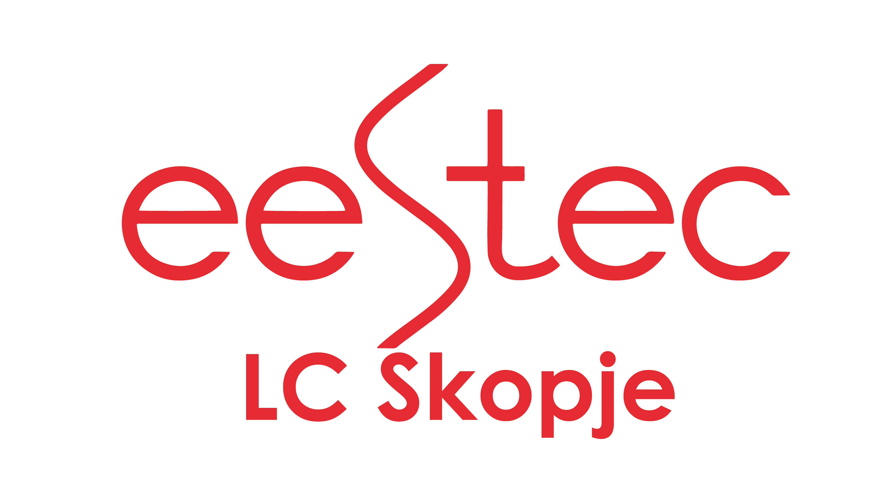

 

    <h1>Welcome EESTECer</h1>
    
This private repository is built by us to help everyone at the Local Committe of Skopje practice and revise their coding skills. If you are reading this, then you are added to list of secret coding agents to help the world. The idea is to spread solutions of coding problems and practice.

 

# How is this project structured?

The project structure currently is as follows, there are 3 main folders:

- `Coding solutions`
- `University Exercises`
- `Code from IT sessions`

In the `Coding solutions` folder you will find folders like `Java`, `Python`, `C`, `C++` and so on. Each solution should be placed in the corresponding folder according to its programming language.

In the `University Exercises` folder you will find folders like `Algorithms and Data Structures`, `Structural Programming`, `Object Oriented Programming`, `Internet Programming`... These folders serve as a database of exercise solutions. When you are ready to contribute your code, this is the first folder you want to start with. If it does not fit in the `University Exercises` then you can place your code in the `Coding solutions` folder.

Finally, there is `Code from IT sessions` folder. In EESTEC LC Skopje we have a weekly meeting facilitated by the IT Coordinator from the current year. All the code from those sessions will be here.

 

# How can I contribute?

Contact your IT Coordinator for details to gain access rights to the repo, or if you have any questions about how to use `git` or where to place your `code`.

